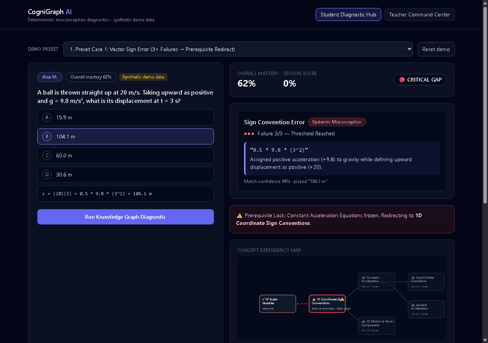
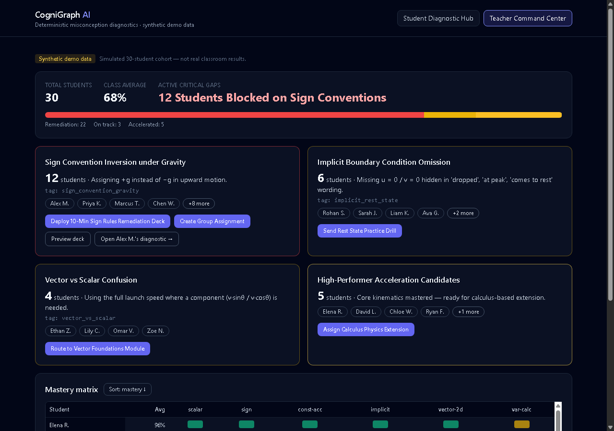

# CogniGraph AI

[](https://github.com/ckhot18/cognigraph/actions)

> Knowledge-graph misconception diagnostics for physics kinematics.
> Scores say *what*; CogniGraph finds *why* — deterministically, explainably, auditably.

CogniGraph AI diagnoses *why* a student got a question wrong, not just *that* they did.
Every wrong answer is mapped (deterministically) to a **remediation tag** and a **severity
tier** (Slip / Partial Mental Model / Systemic Misconception). At **3 failures** on one tag
the engine triggers a **Prerequisite Override**: it walks a Concept Dependency DAG backwards,
finds the lowest unmastered ancestor, freezes downstream topics, and redirects the roadmap.
High performers (>85%, fast, no errors) unlock a **"What's Next?" Acceleration Tier**, and a
**Teacher Command Center** clusters misconceptions across 30 students with 1-click interventions.

Runs **fully offline with zero API keys** — no LLM, no database, no auth. In-memory state + JSON files only.




## Quickstart

```bash
npm ci
npm test          # 24 tests: engine benchmarks, data integrity, API guards
npm run dev       # API :8787 + Vite :5173 (via concurrently)
```

Single-process demo fallback (serves API + built client on `:8787`):

```bash
npm run build
npm start
```

Regenerate the synthetic cohort (seeded, deterministic):

```bash
npm run seed      # node server/scripts/generate-cohort.js
```

Keyboard: `1–4` switch presets, `Enter` runs the diagnostic.

> Windows note: stop any running dev servers before re-running `npm ci`
> (live processes lock `node_modules` and the wipe will fail with EPERM).

## Architecture

```
Preset → (client) POST /api/analyze-submission → analyze.js (pure) → JSON report → React render
```

State mutates only via `commit: true` or `/api/bridge-gap`. All thresholds live in
`server/data/config.json`. The engine is deterministic: same input → same output.

```
cognigraph-ai/
├─ package.json, package-lock.json   # npm workspaces [server, client]
├─ server/
│  ├─ app.js, index.js, store.js     # Express routes + in-memory state
│  ├─ engine/                        # dag, matcher, thresholds, nodeStates,
│  │                                 # analyze, bridge, cohort, validate, config
│  ├─ data/                          # dag, quiz bank, drills, presets, cohort,
│  │                                 # interventions, config (all JSON)
│  └─ test/                          # node:test suites (smoke, data, engine, api)
└─ client/src/
   ├─ student/                       # hub, presets, submission, report, DAG map, bridge
   └─ teacher/                       # command center, clusters, matrix, deck modal
```

See `docs/ARCHITECTURE.md` (data flow + decision table) and `docs/AUTHORING.md`
(how to add a question / tag / node / new domain).

## API

| Method | Route | Purpose |
|---|---|---|
| GET | `/api/health` | liveness |
| GET | `/api/presets` | list preset labels + ids |
| GET | `/api/presets/:id` | full preset (question text, options **without payloads**, seeded profile) |
| GET | `/api/dag` | nodes + edges + positions + tag registry |
| POST | `/api/analyze-submission` | diagnosis report (Section 5.5 contract) |
| GET | `/api/student-roadmap?student_id=` | current node states + roadmap |
| POST | `/api/bridge-gap` | drill evaluation + state transition |
| GET | `/api/teacher-cohort` | clusters, distribution, matrix |
| POST | `/api/teacher-intervention` | 1-click action (deck outline payload) |
| DELETE | `/api/teacher-intervention` | **extension:** undo an intervention (supports the Undo toast) |
| POST | `/api/reset` | re-seed all in-memory state |

Errors: `{"error":{"code":"BAD_REQUEST","message":"…"}}` with correct status codes;
never a stack trace. Guards: 50 kb JSON body limit, `working_text` ≤ 2000 chars,
unknown ids → 404/400, malformed JSON → 400 — the server never crashes on bad input.

## Threshold & severity decision table

`c` = failure count for the tag **including** the current failure. `p` = payload severity.
`T` = `escalation_threshold` (3) from `config.json`.

```
countSeverity(c): 1→SLIP, 2→PARTIAL_MENTAL_MODEL, ≥3→SYSTEMIC_MISCONCEPTION

effectiveSeverity:
  start = countSeverity(c)
  if p == PARTIAL and start == SLIP → PARTIAL        # payload may raise Slip→Partial
  if tag.escalates == false → SLIP                   # arithmetic slips never escalate
  suspected_systemic = (p == SYSTEMIC and effective != SYSTEMIC)

roadmap_action:
  c >= T  → PREREQUISITE_REDIRECT   (blocks root node, freezes descendants)
  c == T-1 → TARGETED_DRILL         (1-step concept bridge drill)
  c < T-1 → HINT_ONLY               (hint, no panic — avoids false alarms)
  non-escalating tag → HINT_ONLY (any c)
  all correct + score > 85 + zero gaps + avg ≤ 45 s → UNLOCK_ACCELERATION
  all correct otherwise → CONTINUE
```

## Demo walkthrough (3 minutes)

1. **Open with the problem.** Scores say *what*; CogniGraph finds *why*.
2. **Case 3** — one early error → "hint only, don't panic" (false-alarm protection).
3. **Case 2** — second failure → Partial mental model → one-step bridge drill.
4. **Case 1** — third failure → **Prerequisite Override**: evidence quote, red root node,
   frozen descendants, traversal trace. Solve the bridge drill → node turns green live.
5. **Case 4** — gold nodes + **What's Next?** panel (F1 telemetry hook).
6. **Teacher Center** — 12 students share one root cause → one click deploys the remediation deck.
7. **Close** — swap the DAG + distractor bank to move to another domain (see `docs/AUTHORING.md`).

## Spec corrections (authoritative resolutions)

| # | Issue | Resolution |
|---|---|---|
| 1 | Distractor `opt_d` "10.2 m" mismatches its error (t² as 6 → 30.6 m) | Uses **30.6 m** |
| 2 | Tag names differ from DAG node IDs | Tag registry in `kinematics_dag.json` maps tag → node + `escalates` |
| 3 | Case 1 shows "Failure 3/3" from one submission | State seeded with `prior_failures` (starts at 2 → this makes 3) |
| 4 | Payload vs count severity conflict | Count drives; payload may raise SLIP→PARTIAL; SYSTEMIC only from count ≥ 3 |
| 5 | `roadmap_action` lacked `HINT_ONLY` | Enum adds `HINT_ONLY` |
| 6 | Teacher cluster sizes/names inconsistent | Four clusters 12/6/4/5 + 3 on-track = 30 |
| 7 | "Free-text analysis" unspecified | Deterministic 3-stage matcher (normalize → numeric → rubric) |
| 8 | Overall mastery not derivable from one question | Presets seed mastery; engine reports `session_score` separately |
| 9 | DAG colors vs state enum | Downstream-of-block renders `LOCKED` (frozen); `IN_PROGRESS` needs mastered prereqs |
| 10 | Arithmetic slips must never lock out | `escalates: false` caps at `SLIP` / `HINT_ONLY` |

## Known limitations (honest framing)

1. **Synthetic data is labelled.** Cohort + seeded states are simulated; Teacher view shows
   "Synthetic demo data". Never real classroom results.
2. **Thresholds are design choices.** 3-failure escalation, 85% acceleration cutoff, 45 s speed
   rule are heuristics in `config.json`, tested as configurable — not validated findings.
3. **Confidence is match confidence**, not a calibrated probability (labelled "Match confidence" in UI).
4. **Distractor payloads are hand-authored.** 6 questions, one domain; real deployment needs a
   larger expert-reviewed bank.
5. **Free-text analysis is rule-based and brittle**; degrades to `UNCLASSIFIED` otherwise
   (unusual notation, mixed units, multi-step working).
6. **Guessing exists** — a wrong pick may be a guess; escalation needs repeated failures for this reason.
7. **Not a full learner model** — no Bayesian knowledge tracing / IRT; mastery is seeded, not learned.
8. **Domain-agnostic means data-driven** — new domains need a new DAG + bank (`docs/AUTHORING.md`).
9. **State is in-memory, single-user** — restarts reset everything (intentional, repeatable demo).
10. **Privacy/tone** — synthetic names only; engine flags misconceptions, never students.
11. **Teacher stays in control** — 1-click actions are suggestions with toast + Undo.
12. **Quality bar** — engine unit-tested + deterministic; UI verified headless (Cases 1–4, drill
    solve, deploy/undo, cross-link, 1280px + 390px viewports, no console errors).
13. **Dependencies** — `npm audit`: runtime chain clean (express bumped to patched 4.22.3);
    10 advisories (3 moderate, 7 high) remain in **dev-only** chains (vite/esbuild) where fixes
    need breaking `--force` upgrades — noted, not applied.
14. **Observability** — tiny request logger (`method path status ms`), no payload logging.

## Deviations from spec

- `npm test` runs `node --test` with an **explicit file list** instead of `server/test`
  (bare-dir arg fails on this toolchain; glob patterns need Node 21+, CI pins Node 20).
  New test files must be appended to the `test` script.
- The Student Hub runs diagnostics with `commit: true` so the bridge drill acts on the stored
  prerequisite block; **Reset demo** re-seeds for repeatability.
- Added `drill_accel_01`: the shipped bank had no drill for escalating tag `constant_accel_eqs`,
  which `validate.js` (spec 5.8 rule 5) correctly rejects.
- Added `DELETE /api/teacher-intervention` (undo) to support the Undo toast (spec 10 P1).

## Roadmap (deferred P2)

General matrix click-through (any cohort student → diagnostic), print stylesheet,
Physics⇄C++ domain switcher, optional LLM free-text fallback, Playwright smoke test.

## Repo

- URL: https://github.com/ckhot18/cognigraph
- Branch: `main` · CI: `.github/workflows/ci.yml` (`npm ci && npm test && npm run build`)
- Tags: `v0.1.0` (engine + API), `v0.2.0` (both dashboards), `v1.0.0` (release)
